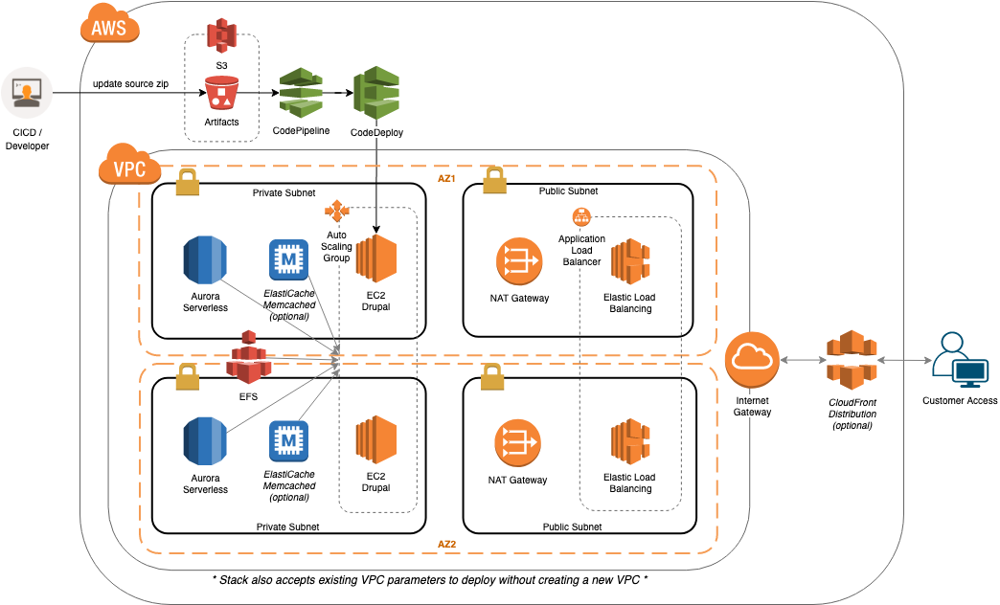

# Ordinary Experts Drupal 8 on AWS Pattern

## Drupal Stack

## Setup

We are following the [3 Musketeers](https://3musketeers.io/) pattern for project layout / setup.

First, install [Docker](https://www.docker.com/), [Docker Compose](https://docs.docker.com/compose/), and [Make](https://www.gnu.org/software/make/).

Then:

    $ make build
    $ make synth
    $ aws-vault exec oe-patterns-dev -- make deploy
