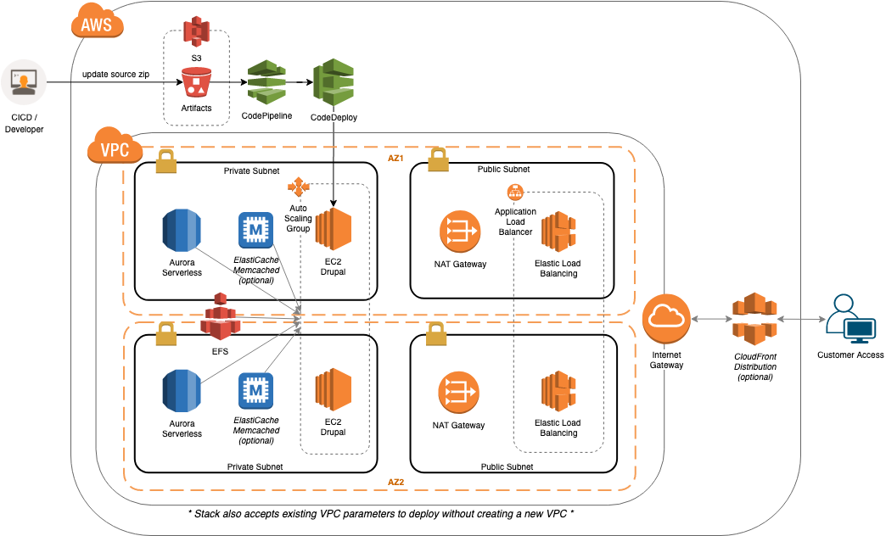

# Drupal on AWS by FOSSonCloud

A FOSSonCloud AWS Marketplace Product

Drupal on AWS by FOSSonCloud is an open-source AWS CloudFormation template + custom AMI that deploys a production-ready Drupal 11 site on AWS, using AWS and Drupal best practices.

Want to get started? Read the [Deployment Guide](DEPLOYMENTGUIDE.md).

## Stack components

* Apache 2.4
* PHP 8.3
* Drupal 11
* Aurora MySQL 8.0
* ElastiCache Memcached
* Composer + Drush (in pipeline transform stage)

The template provisions Amazon EC2, Amazon VPC, Amazon Aurora, Amazon EFS, Amazon S3, AWS CodePipeline, AWS CodeBuild, AWS CodeDeploy, AWS Secrets Manager, Amazon ElastiCache, and (optionally) Amazon CloudFront.

Auto Scaling Groups front the application; an EFS file system shares user-generated content between application servers; a CodePipeline monitors an S3 location to roll out new builds across the fleet.

SSL is on by default via an existing ACM certificate. Multi-AZ Aurora MySQL provides database high availability. AWS Secrets Manager holds credentials at rest and in transit; IAM provides least-privilege access.

## Stack diagram

## Optional features

* CloudFront CDN with cache-invalidation Lambda
* Bring-your-own VPC, or let the stack create a new one

## Setup

This project follows the [3 Musketeers](https://3musketeers.io/) pattern.

Install [Docker](https://www.docker.com/), [Docker Compose](https://docs.docker.com/compose/), and [Make](https://www.gnu.org/software/make/), then see the [Deployment Guide](DEPLOYMENTGUIDE.md).

## Development

See [DEVELOPMENT.md](DEVELOPMENT.md).

## Upgrading from 2.x

The 3.0.0 release is a major rewrite. See [UPGRADE.md](UPGRADE.md) for the migration path from 2.x deployments.

## Feedback

To post feedback, submit feature ideas, or report bugs, use the [Issues section](https://github.com/ordinaryexperts/aws-marketplace-oe-patterns-drupal/issues) of this GitHub repo.
