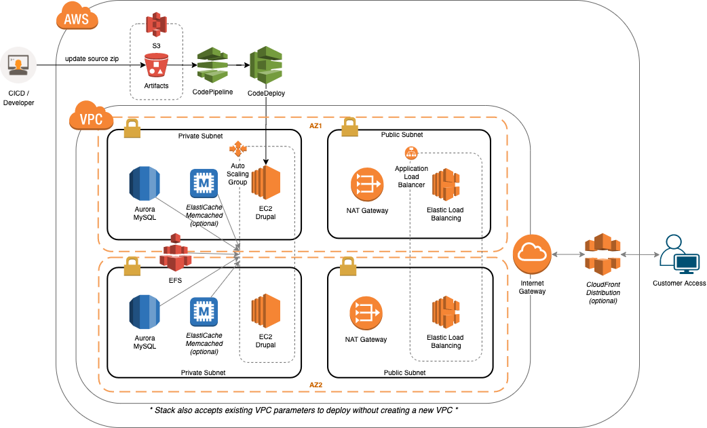

# Drupal on AWS by FOSSonCloud

A FOSSonCloud AWS Marketplace Product

Drupal on AWS by FOSSonCloud is an open-source AWS CloudFormation template + custom AMI that deploys a production-ready Drupal 11 site on AWS, using AWS and Drupal best practices.

## Stack components

* Apache 2.4 + PHP 8.3 (Ubuntu 24.04)
* Drupal 11.3.8 (composer-installed, baked into the AMI)
* Drush 13 (bundled in the AMI for admin work)
* Aurora MySQL 8.0 (multi-AZ)
* ElastiCache Memcached
* EFS for the Drupal codebase + sites/default/files (shared between instances)

The template provisions Amazon EC2, Amazon VPC, Amazon Aurora, Amazon EFS, Amazon ElastiCache, AWS Secrets Manager, and AWS Route53.

The Drupal codebase ships baked into `/root/drupal` in the AMI. On first instance boot, user_data copies it into EFS (`/mnt/efs/drupal`) and symlinks Apache's docroot at `/var/www/app/drupal`. Subsequent instances see the existing EFS-resident codebase and skip the copy. Customer code edits happen via the Drupal admin UI or by SSM Session Manager onto an instance.

SSL is on by default via an existing ACM certificate on the ALB. Multi-AZ Aurora MySQL provides database high availability. AWS Secrets Manager holds the database credentials.

## Stack diagram

## Bring-your-own options

* Existing VPC + subnets, or let the stack create a new one
* Existing Secrets Manager secret for the Aurora cluster credentials

## Deployment

Subscribe via the AWS Marketplace product listing, accept the terms, then launch the CloudFormation template. Required parameters:

| Parameter | Description |
|---|---|
| `AlbCertificateArn` | ACM certificate ARN for HTTPS on the ALB (in the deployment region) |
| `DnsHostname` | Hostname the site will be served at (e.g. `drupal.example.com`) |
| `DnsRoute53HostedZoneName` | Route53 hosted zone that owns the `DnsHostname` (e.g. `example.com.`) |

Optional: `NotificationEmail` for SNS deploy notifications, `DbBackupRetentionPeriod`, instance types for ASG/Aurora/Memcached, BYO VPC/secret. Defaults are sensible for a production-grade single-region deploy.

When the stack reaches `CREATE_COMPLETE`, browse to your `DnsHostname` URL and walk through the Drupal install wizard. Database connection is pre-populated; you only enter site name and admin credentials.

## Development

See [DEVELOPMENT.md](DEVELOPMENT.md) for the local build / test / publish workflow.

## Upgrading from 2.x

The 3.0.0 release is a major rewrite. See [UPGRADE.md](UPGRADE.md) for the migration path from 2.x deployments.

## Feedback

To post feedback, submit feature ideas, or report bugs, use the [Issues section](https://github.com/ordinaryexperts/aws-marketplace-oe-patterns-drupal/issues) of this GitHub repo.
